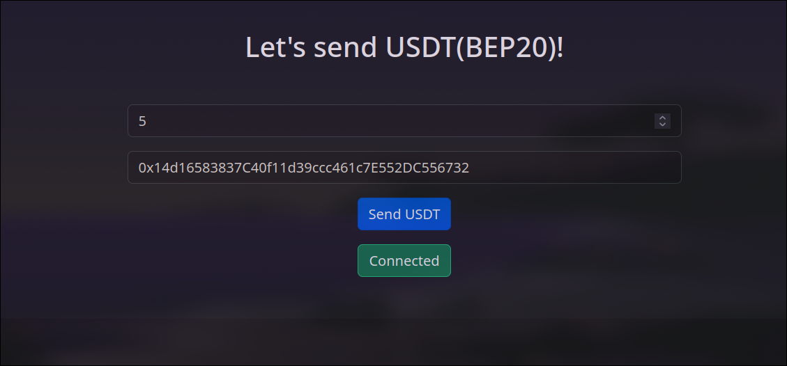
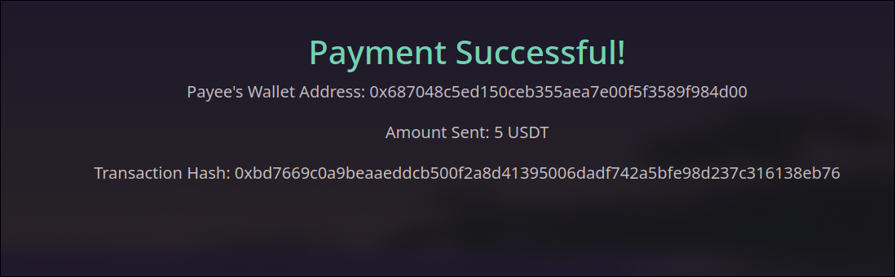

# Metamask BEP20 Payment Web App

This web app allows users to make payments using **USDT BEP20 tokens** on the **BSC Testnet** via MetaMask. It's designed for demonstration purposes and includes the ability to store and display payment status.

## Features

- Connect MetaMask wallet to the app.
- Make payments in **USDT BEP20 tokens** on the BSC Testnet.
- Display transaction details (such as transaction hash, amount sent, error message, and status) after payment.
- Payment status is stored in session and displayed on the `paymentStatus.html` page.

## Getting Started

### Prerequisites

To try out this app, you'll need:

1. **MetaMask** browser extension installed.
2. **BSC Testnet** setup in MetaMask. Instructions on how to add the BSC Testnet can be found [here](https://academy.binance.com/en/articles/connecting-metamask-to-binance-smart-chain).
3. **USDT BEP20 tokens** on the **BSC Testnet**. You can get some from a BSC Testnet faucet. Use the contract address:
   ```
   0x337610d27c682E347C9cD60BD4b3b107C9d34dDd
   ```
   to interact with USDT BEP20 tokens for this demo.

### Installation

1. Clone this repository:

   ```bash
   git clone https://github.com/AgSpades/metamask-payment.git
   cd metamask-payment
   ```

2. Open the `index.html` file using live server extension on VS Code or any other appropriate alternatives.

3. Make sure your MetaMask is set to the **BSC Testnet** and that you have some **USDT BEP20** tokens.

---

## Usage

1. **Connect MetaMask**: Once the page loads, click on the Connect Wallet button.

2. **Make a Payment**:

   - Enter the desired amount of USDT to send.
   - Enter the recepient's public address and click the "Pay" button.
     

3. **View Payment Status**:
   - After the transaction is processed, the `paymentStatus.html` page will display the details, including the transaction hash, status message, and amount sent.
     

## How it Works

### Code Overview

1. **index.html**:

   - This file contains the user interface that allows the user to connect their MetaMask wallet and make payments.

2. **script.js**:

   - Contains the core logic for interacting with MetaMask and the BSC Testnet. The usdt contract address (`usdtContractAddress`) is currently for the BNB Smart Chain Testnet. To use this on the BSC Mainnet, replace the contract address with the **USDT BEP20 contract address** from the BSC Mainnet, along with the appropriate `usdtABI`.

3. **paymentStatus.html**:

   - Displays payment status, including the transaction hash, status message, and other details after the user completes a transaction.

4. **usdtABI.txt**:
   - Contains the ABI (Application Binary Interface) for the USDT contract on BSC. This file doesn't serve any purpose.

## Switching to BSC Mainnet

If you want to make payments using **USDT BEP20 tokens** on the **BSC Mainnet**, follow these steps:

1. Update the `usdtContractAddress` in `script.js` with the **USDT BEP20 Contract Address** from the [BSC Mainnet](https://bscscan.com/token/0x55d398326f99059ff775485246999027b3197955).
2. Replace the `usdtABI` in the `script.js` file with the appropriate ABI for the USDT BEP20 contract on the BSC Mainnet.

## License

This project is licensed under the MIT License - see the [LICENSE](LICENSE) file for details.
